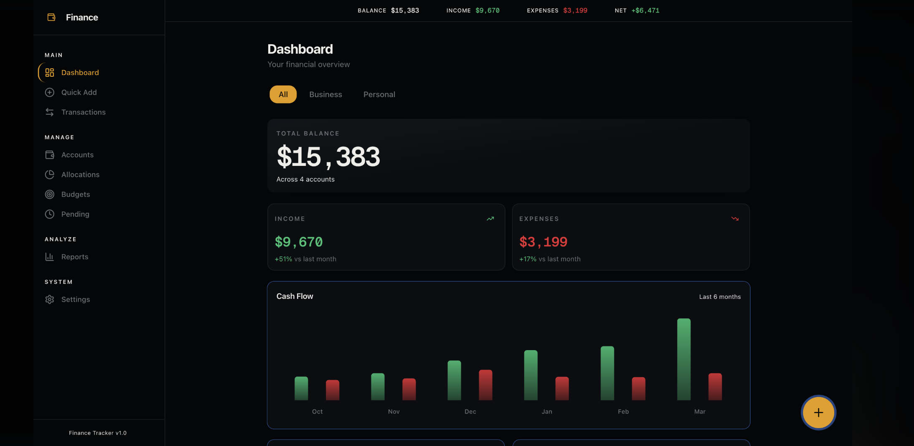
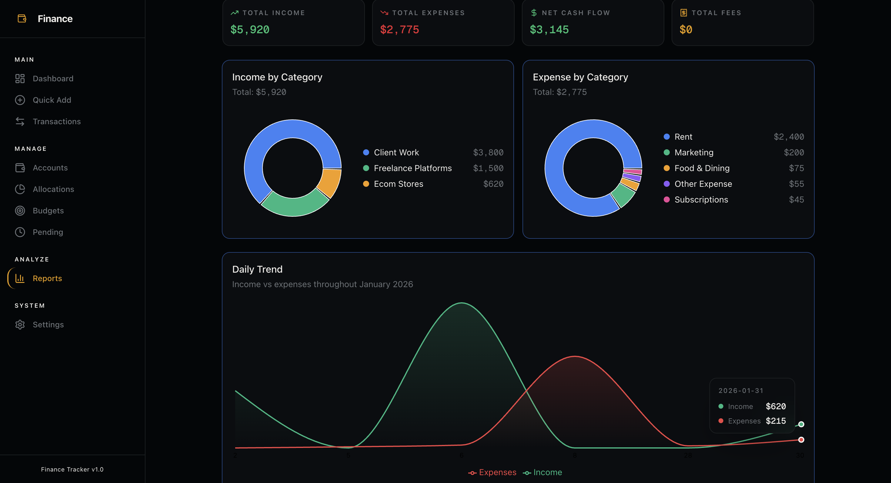
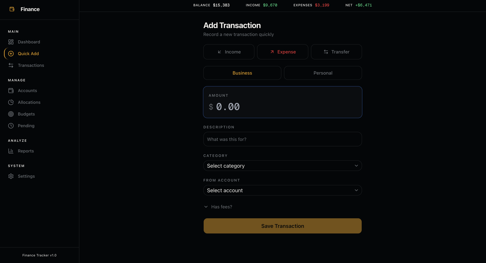
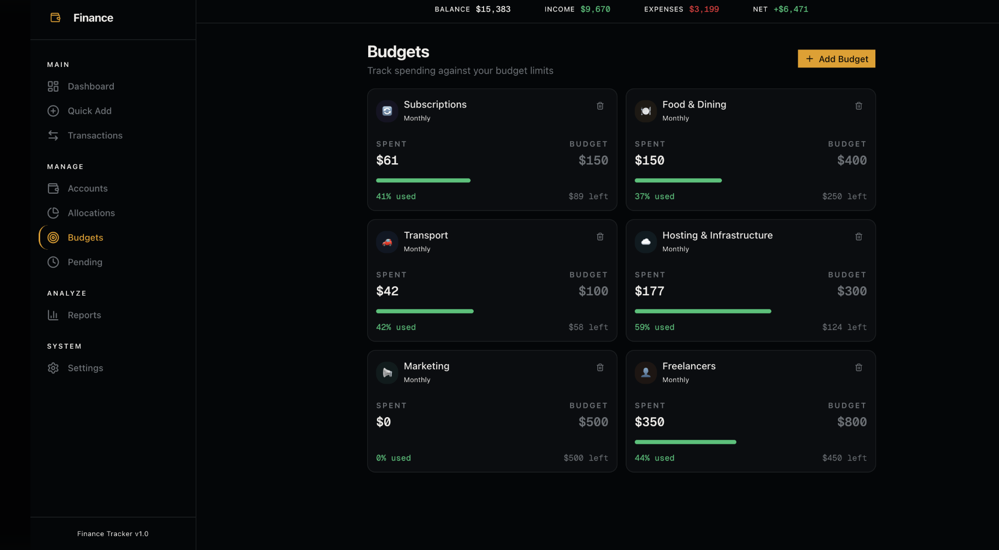
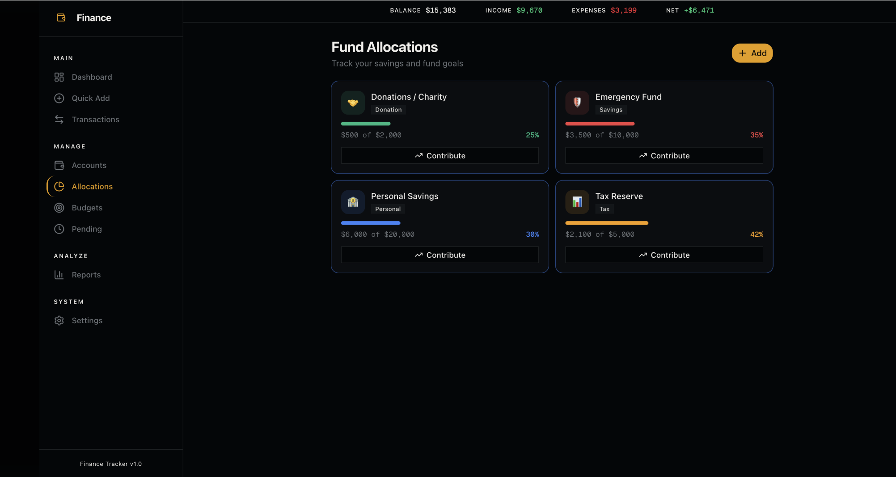
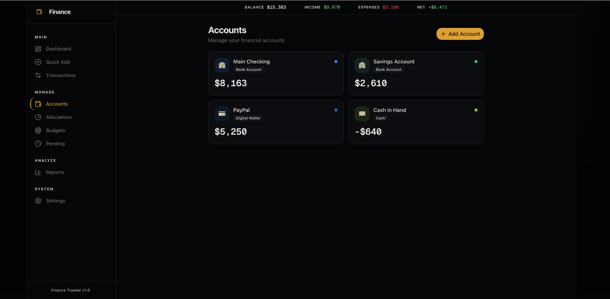

# Personal-Data-Automation-Financial-Intelligence-Platform
Progressive Web App that automates personal financial data tracking by combining manual inputs with email based data ingestion pipelines to maintain real time analytics dashboards.

This project is a Progressive Web Application designed to simplify personal financial tracking and improve decision visibility through automated data ingestion and structured analytics workflows.

The system allows users to manually record financial activity while also enabling automated extraction of relevant transaction information from incoming emails. Extracted data is processed through backend pipelines, structured into analytics ready formats, and synchronized with real time dashboards for performance monitoring.

The platform focuses on reducing manual tracking effort, improving data consistency, and providing a centralized view of financial behavior across accounts, categories, and time horizons. Built with a mobile first architecture, the application supports cross device usage and scalable integration with external data sources.

⸻

⭐ Tech Stack Section (Add This)

Tech Stack
	•	Progressive Web App (PWA) architecture
	•	React / Next.js frontend
	•	FastAPI backend services
	•	REST API based workflow integration
	•	Email data parsing and ingestion pipelines
	•	PostgreSQL database
	•	Real time dashboard analytics
	•	Responsive mobile first design

⸻

⭐ Features Section

Key Features
	•	Manual financial activity logging and categorization
	•	Automated email based data ingestion and structuring
	•	Real time dashboard updates and performance tracking
	•	Cross device accessibility through PWA deployment
	•	Modular backend architecture for workflow automation
	•	Scalable design for integration with external financial data sources

  ## Dashboard Overview

Centralized financial visibility across accounts, income streams, expenses, and net performance trends.

## Analytics & Reporting

Interactive charts for category wise income, expense distribution, and cash flow trends.

## Quick Transaction Entry

Fast manual transaction logging with categorized inputs and account mapping.

## Budget Management

Track monthly spending limits, monitor utilization, and maintain better financial discipline.

## Fund Allocation Tracking

Visual goal tracking for savings, emergency funds, charity contributions, and tax reserves.

## Account Overview

Unified view of balances across bank accounts, digital wallets, and cash positions.
